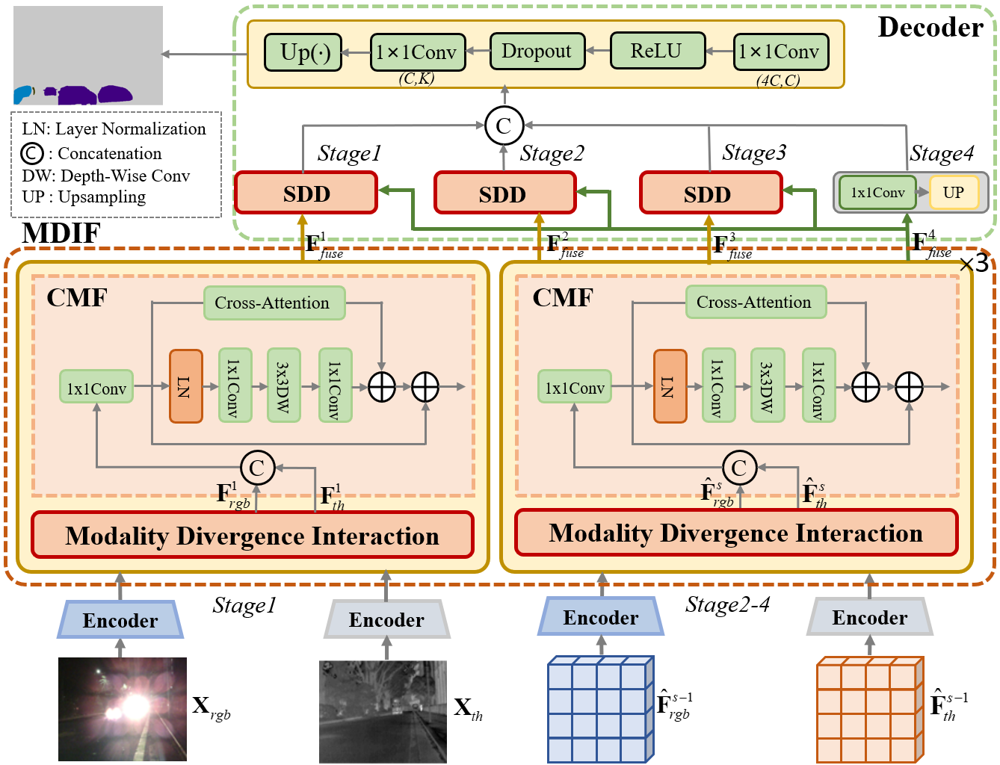
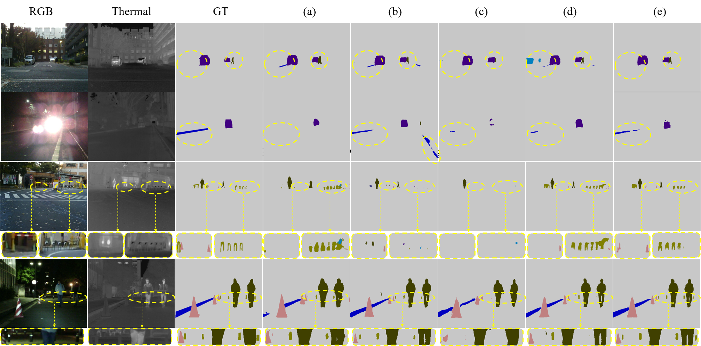

# Modality Divergence-aware Dynamic Gating for RGB-T Semantic Segmentation
This is official pytorch implementation of "Modality Divergence-aware Dynamic Gating for RGB-T Semantic Segmentation".  <br/>

## Introduction
<div align="center">

</div>
<br/>RGB-Thermal semantic segmentation employs complementary visual information of both RGB and thermal images to predict pixel-level label maps. How to learn their complementary features and fuse them poses great challenge. However, previous methods adopt the same fusion strategy on all features, which neglects two facts: 1) non-symmetry of RGB and thermal modalities makes semantic-consistency and semantic-inconsistency features co-exist between two modalities, and 2) low-level feature fusion may bring about some noise such as clutter background which adds difficulty in feature decoding. To address these issues, we develop a Modality Divergence-aware Dynamic Gating approach for RGB-T semantic segmentation. In particular, it primarily consists of the modality divergence interaction module and the semantic dynamic decoding module. The former focuses on semantic divergence features by adopting local cross-attention to capture complementary features of corresponding locations and using bi-directional scanning of channel Mamba to establish dual-modality feature relations. Meanwhile, the latter involves dynamic linear layer to model interaction relations between high-level and low-level features by dynamic weighting model, while developing a dynamic frequency gating mechanism to strengthen or weaken features in frequency domain. This helps segment small objects and better capture object contours. Empirical studies on three benchmarks including MFNet, PST900, and FMB demonstrate the superiority of the proposed approach.

## Install Dependencies
The code is written in Python 3.10 and Cuda 11.8 using the following libraries:

```
python==3.10.14
torch==2.3.1
torchaudio==2.3.1
torchvision==0.18.1
natten==0.17.1
```

Install the libraries using [requirements.txt](requirements.txt) as:

```
pip install -r requirements.txt
```

## Data
For training, download the MFNet dataset from [here](https://github.com/haqishen/MFNet-pytorch) and please modify the path to the dataset in code.
<br/>


## Folder Structure
While training, the models are saved in a folder specifying the hyper-parameters for that run under the [exp](exp) directory, including the .pth file and the .log file. The directory structure looks like this:
```
MDDG
├─configs
│      mf_rgbt.yaml
│
├─exp
│      exp.txt
│
├─semseg
│  │  augmentations.py
│  │  augmentations_mm.py
│  │  losses.py
│  │  metrics.py
│  │  optimizers.py
│  │  schedulers.py
│  │  __init__.py
│  │
│  ├─datasets
│  │      MF.py
│  │      __init__.py
│  │
│  ├─models
│  │  │  base.py
│  │  │  MDDG.py
│  │  │  __init__.py
│  │  │
│  │  ├─backbones
│  │  │      MDDG.py
│  │  │      __init__.py
│  │  │
│  │  ├─heads
│  │  │      Dynamics_Head.py
│  │  │      segformer.py
│  │  │      __init__.py
│  │  │
│  │  └─layers
│  │      │  common.py
│  │      │  initialize.py
│  │      │  MultiModality_CA.py
│  │      │  VMamba.py
│  │      │  __init__.py
│  │      │
│  │      └─selective_scan
│  │          │  readme.md
│  │          │  setup.py
│  │          │  test_selective_scan.py
│  │          │
│  │          ├─csrc
│  │          │  └─selective_scan
│  │          │          reverse_scan.cuh
│  │          │          selective_scan.cpp
│  │          │          selective_scan.h
│  │          │          selective_scan_bwd_kernel.cuh
│  │          │          selective_scan_common.h
│  │          │          selective_scan_core.cu
│  │          │          selective_scan_core_fwd2.cu
│  │          │          selective_scan_core_fwd3.cu
│  │          │          selective_scan_core_fwd4.cu
│  │          │          selective_scan_fwd_kernel.cuh
│  │          │          static_switch.h
│  │          │          uninitialized_copy.cuh
│  │          │
│  │          └─selective_scan
│  │                  selective_scan_interface.py
│  │                  __init__.py
│  │
│  └─utils
│          utils.py
│          visualize.py
│          __init__.py
│
└─tools
        infer_mm.py
        test_context.py
        test_na2d.py
        train.sh
        train_ddp.py
        train_ddp.sh
        train_mm.py
        val_mm.py
```

<br/>

## Quantitative results on MF-Data
<table>
   <tr>
      <td>Model</td>
      <td>mIoU</td>
      <td>mAcc</td>
      <td>GFlops</td>
      <td>Params</td>  
   </tr>
   <tr>
      <td>MDDG-B2</td>
      <td>61.7</td>
      <td>76.9</td>
      <td>65.7</td>
      <td>56.8</td>
   </tr>
   <tr>
      <td>MDDG-B4</td>
      <td>62.4</td>
      <td>77.4</td>
      <td>99.5</td>
      <td>93.4</td>
   </tr>
</table>


## Qualitative results  on Cityscapes
<br/>


## Training & Testing
### Training the MiT-B2 on MF Datasets:
Use the command below for training, modify the run-time arguments (like hyper-parameters for training, path to save the models, etc.) as required:
```
bash tools/train_ddp.sh 
```
<br/>

### Testing the MiT-B2 on MF Datasets:
Before testing, place the trained model file and modify model_path='your model file path'in the scripts/eval.sh and use the command below for testing:
```
python tools/val_mm.py 
```
<br/>

## Citation

If you find this repo useful, please cite the following paper.

```
@article{Modality Divergence-aware Dynamic Gating for RGB-T semantic segmentation,
  author    = {},
  title     = {},
  journal   = {},
  volume    = {},
  pages     = {},
  year      = {2025}
}
```

## Contact

For any issues, please contact Mr. Tang Chen via email tangc@hdu.edu.cn

## Acknowledgement

We would like to thank the authors of [SegFormer] (https://github.com/NVlabs/SegFormer), which has significantly accelerated the development of our Method.
